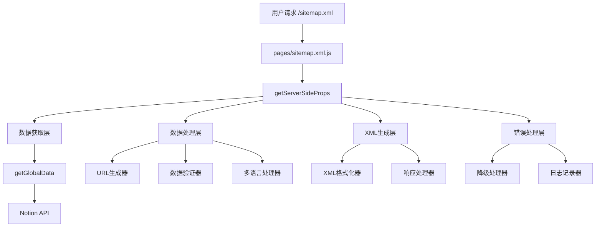
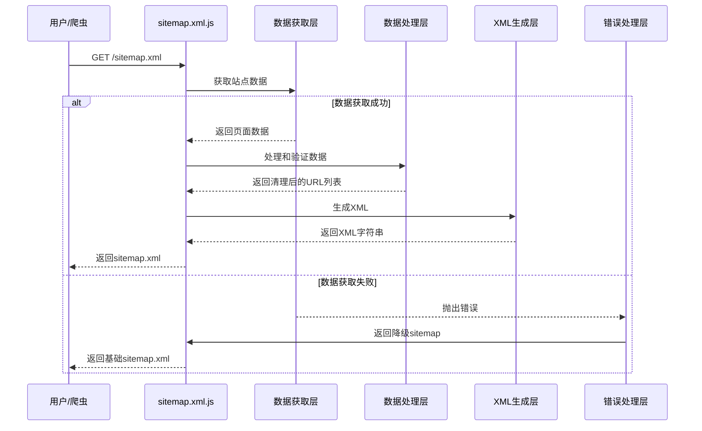

# 动态Sitemap生成修复设计文档

## 概述

当前的动态sitemap生成存在多个问题：
1. `pages/sitemap.xml.js`中的过滤条件使用了错误的状态值比较
2. 缺乏有效的错误处理和降级机制
3. 多语言处理逻辑复杂且容易出错
4. 缺乏统一的URL验证和清理机制

本设计将修复这些问题，并提供一个更加健壮和可维护的sitemap生成系统。

## 架构

### 整体架构图



### 数据流图



## 组件和接口

### 1. 主要组件

#### SitemapGenerator (主生成器)
```javascript
class SitemapGenerator {
  constructor(config) {
    this.config = config
    this.urlValidator = new URLValidator()
    this.xmlFormatter = new XMLFormatter()
    this.errorHandler = new ErrorHandler()
  }

  async generateSitemap(siteIds) {
    // 主要生成逻辑
  }
}
```

#### URLValidator (URL验证器)
```javascript
class URLValidator {
  isValidSlug(slug) {
    // 验证slug是否有效
  }

  isValidURL(url) {
    // 验证完整URL是否有效
  }

  cleanURL(url) {
    // 清理和标准化URL
  }
}
```

#### XMLFormatter (XML格式化器)
```javascript
class XMLFormatter {
  generateXML(urls) {
    // 生成标准XML格式
  }

  escapeXML(str) {
    // XML转义处理
  }
}
```

#### ErrorHandler (错误处理器)
```javascript
class ErrorHandler {
  handleError(error, context) {
    // 统一错误处理
  }

  generateFallbackSitemap() {
    // 生成降级sitemap
  }
}
```

### 2. 核心接口

#### ISitemapURL
```typescript
interface ISitemapURL {
  loc: string
  lastmod: string
  changefreq: 'always' | 'hourly' | 'daily' | 'weekly' | 'monthly' | 'yearly' | 'never'
  priority: string
}
```

#### ISiteData
```typescript
interface ISiteData {
  allPages: IPage[]
  siteInfo: ISiteInfo
  locale?: string
}
```

#### IPage
```typescript
interface IPage {
  id: string
  title: string
  slug: string
  status: 'Published' | 'Invisible' | 'Draft'
  type: 'Post' | 'Page' | 'Menu' | 'Notice'
  publishDay: string
  lastEditedDate?: string
  category?: string
  tags?: string[]
}
```

## 数据模型

### 配置模型
```javascript
const SitemapConfig = {
  baseUrl: 'https://www.shareking.vip',
  maxUrls: 50000,
  maxSizeBytes: 50 * 1024 * 1024, // 50MB
  cacheMaxAge: 3600, // 1小时
  staleWhileRevalidate: 59,
  priorities: {
    home: '1.0',
    posts: '0.8',
    pages: '0.7',
    categories: '0.6',
    tags: '0.5',
    rss: '0.7'
  },
  changeFrequencies: {
    home: 'daily',
    posts: 'weekly',
    pages: 'monthly',
    categories: 'weekly',
    tags: 'weekly'
  }
}
```

### URL生成规则
```javascript
const URLGenerationRules = {
  // 静态页面
  staticPages: [
    { path: '', priority: '1.0', changefreq: 'daily' },
    { path: '/archive', priority: '0.8', changefreq: 'daily' },
    { path: '/category', priority: '0.8', changefreq: 'daily' },
    { path: '/search', priority: '0.6', changefreq: 'weekly' },
    { path: '/tag', priority: '0.8', changefreq: 'daily' }
  ],
  
  // 动态页面规则
  dynamicPages: {
    posts: {
      filter: (page) => page.type === 'Post' && page.status === 'Published',
      urlPattern: '/{slug}',
      priority: '0.8',
      changefreq: 'weekly'
    },
    pages: {
      filter: (page) => page.type === 'Page' && page.status === 'Published',
      urlPattern: '/{slug}',
      priority: '0.7',
      changefreq: 'monthly'
    }
  }
}
```

## 错误处理

### 错误分类和处理策略

#### 1. 数据获取错误
- **Notion API超时**: 使用缓存数据或降级sitemap
- **网络连接失败**: 返回基础sitemap
- **认证失败**: 记录错误，返回降级sitemap

#### 2. 数据处理错误
- **无效的页面数据**: 跳过该页面，继续处理其他页面
- **URL格式错误**: 清理或跳过无效URL
- **日期格式错误**: 使用当前日期作为默认值

#### 3. XML生成错误
- **内容过大**: 分页处理或移除低优先级内容
- **格式错误**: 使用模板生成基础XML

### 降级策略
```javascript
const FallbackStrategy = {
  level1: {
    // 使用缓存数据
    description: '使用最近一次成功生成的sitemap缓存',
    condition: 'cache available && cache age < 24h'
  },
  level2: {
    // 基础静态sitemap
    description: '生成包含基础页面的静态sitemap',
    condition: 'no cache or cache too old'
  },
  level3: {
    // 最小化sitemap
    description: '仅包含首页的最小sitemap',
    condition: 'all other strategies failed'
  }
}
```

## 测试策略

### 单元测试
1. **URL验证器测试**
   - 测试各种有效和无效的slug格式
   - 测试URL清理功能
   - 测试多语言URL处理

2. **XML格式化器测试**
   - 测试XML转义功能
   - 测试大量URL的XML生成
   - 测试XML格式验证

3. **错误处理器测试**
   - 测试各种错误场景的处理
   - 测试降级策略的触发
   - 测试错误日志记录

### 集成测试
1. **端到端sitemap生成测试**
   - 测试完整的sitemap生成流程
   - 测试多语言站点的sitemap生成
   - 测试大量数据的处理性能

2. **错误场景测试**
   - 模拟Notion API失败
   - 模拟网络超时
   - 模拟数据格式错误

### 性能测试
1. **响应时间测试**
   - 测试不同数据量下的响应时间
   - 测试并发请求的处理能力
   - 测试内存使用情况

2. **缓存效果测试**
   - 测试缓存命中率
   - 测试缓存更新机制
   - 测试缓存失效处理

## 实现细节

### 关键修复点

#### 1. 状态过滤修复
当前代码中的问题：
```javascript
// 错误的过滤条件
p.status === BLOG.NOTION_PROPERTY_NAME.status_publish
```

修复后：
```javascript
// 正确的过滤条件
p.status === 'Published'
```

#### 2. 多语言处理优化
```javascript
function processMultiLanguageSites(siteIds) {
  const results = []
  const errors = []
  
  for (const siteId of siteIds) {
    try {
      const data = await processSingleSite(siteId)
      results.push(data)
    } catch (error) {
      errors.push({ siteId, error })
      // 继续处理其他站点，不中断整个流程
    }
  }
  
  return { results, errors }
}
```

#### 3. URL验证增强
```javascript
function validateAndCleanURL(url, baseUrl) {
  // 1. 基础验证
  if (!url || typeof url !== 'string') return null
  
  // 2. 协议验证
  if (!url.startsWith('http')) return null
  
  // 3. 域名验证
  if (!url.startsWith(baseUrl)) return null
  
  // 4. 特殊字符过滤
  if (url.includes('#') || url.includes('?')) return null
  
  // 5. 黑名单域名过滤
  const blacklistedDomains = [
    'github.com',
    'tangly1024.com',
    'docs.tangly1024.com'
  ]
  
  for (const domain of blacklistedDomains) {
    if (url.includes(domain)) return null
  }
  
  return url
}
```

#### 4. 响应头优化
```javascript
function setOptimalHeaders(res) {
  res.setHeader('Content-Type', 'application/xml; charset=utf-8')
  res.setHeader('Cache-Control', 'public, max-age=3600, stale-while-revalidate=59')
  res.setHeader('X-Robots-Tag', 'noindex') // sitemap本身不需要被索引
  res.setHeader('Vary', 'Accept-Encoding')
}
```

### 性能优化策略

#### 1. 数据处理优化
- 使用流式处理大量数据
- 实现分页处理避免内存溢出
- 优化数据结构减少内存占用

#### 2. 缓存策略
- 实现多层缓存机制
- 使用智能缓存失效策略
- 支持增量更新

#### 3. 并发处理
- 并行处理多个站点数据
- 使用连接池优化数据库访问
- 实现请求去重机制

## 监控和日志

### 关键指标监控
1. **性能指标**
   - sitemap生成时间
   - 内存使用峰值
   - 并发请求处理能力

2. **质量指标**
   - 生成的URL数量
   - 无效URL过滤数量
   - 错误发生频率

3. **业务指标**
   - 搜索引擎访问频率
   - sitemap更新频率
   - 缓存命中率

### 日志记录策略
```javascript
const LoggingStrategy = {
  info: [
    'sitemap generation started',
    'sitemap generation completed',
    'cache hit/miss events'
  ],
  warn: [
    'invalid URLs filtered',
    'fallback strategy triggered',
    'performance threshold exceeded'
  ],
  error: [
    'data fetch failures',
    'XML generation errors',
    'system exceptions'
  ]
}
```