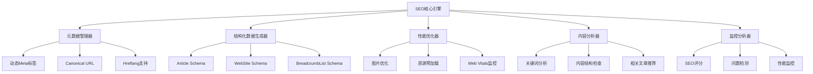

# SEO优化设计文档

## 概述

本设计文档描述了NotionNext博客系统的SEO优化功能架构。该系统通过模块化设计，提供全面的SEO优化功能，包括元数据管理、结构化数据生成、性能优化、内容分析和监控等核心功能。

## 架构

### 系统架构图



## 组件和接口

### 1. SEO核心组件

#### SEOEnhanced组件
- **位置**: `components/SEOEnhanced.js`
- **功能**: 增强版SEO组件，集成所有SEO功能
- **接口**:
  ```javascript
  interface SEOEnhancedProps {
    post?: Object;
    siteInfo?: Object;
    customMeta?: Object;
    enableStructuredData?: boolean;
    enableAnalytics?: boolean;
  }
  ```

#### DynamicMetaTags组件
- **位置**: `components/DynamicMetaTags.js`
- **功能**: 动态生成页面元数据标签
- **接口**:
  ```javascript
  interface MetaTagsProps {
    title: string;
    description: string;
    keywords?: string[];
    canonicalUrl?: string;
    ogImage?: string;
    pageType: 'article' | 'website' | 'category' | 'tag';
  }
  ```

### 2. 结构化数据系统

#### StructuredDataGenerator
- **位置**: `lib/seo/structuredData.js`
- **功能**: 生成符合Schema.org标准的结构化数据
- **主要方法**:
  ```javascript
  generateArticleSchema(post, siteInfo)
  generateWebSiteSchema(siteInfo)
  generateOrganizationSchema(siteInfo)
  generateBreadcrumbSchema(breadcrumbs)
  ```

### 3. 性能优化组件

#### OptimizedImage组件
- **位置**: `components/OptimizedImage.js`
- **功能**: 优化图片加载和SEO
- **特性**:
  - WebP/AVIF格式支持
  - 懒加载
  - 自动alt属性生成
  - 响应式图片

#### ResourcePreloader
- **位置**: `components/ResourcePreloader.js`
- **功能**: 关键资源预加载管理
- **特性**:
  - DNS预解析
  - 关键CSS预加载
  - 字体预加载

### 4. 内容分析工具

#### SEOContentAnalyzer
- **位置**: `components/SEOContentAnalyzer.js`
- **功能**: 内容SEO分析和优化建议
- **分析项目**:
  - 关键词密度
  - 标题层级结构
  - 内部链接分析
  - 内容可读性

#### RelatedPosts组件
- **位置**: `components/RelatedPosts.js`
- **功能**: 相关文章推荐
- **算法**: 基于标签、分类和内容相似度

### 5. 监控和分析系统

#### WebVitalsMonitor
- **位置**: `components/WebVitalsMonitor.js`
- **功能**: Core Web Vitals监控
- **监控指标**:
  - FCP (First Contentful Paint)
  - LCP (Largest Contentful Paint)
  - FID (First Input Delay)
  - CLS (Cumulative Layout Shift)

#### SEOAnalysisEngine
- **位置**: `lib/seo/seoTester.js`
- **功能**: SEO分析和评分
- **分析维度**:
  - 技术SEO
  - 内容质量
  - 用户体验
  - 性能指标

## 数据模型

### SEO配置模型
```javascript
interface SEOConfig {
  siteName: string;
  siteDescription: string;
  siteUrl: string;
  defaultImage: string;
  twitterHandle?: string;
  facebookAppId?: string;
  enableStructuredData: boolean;
  enableAnalytics: boolean;
  enablePerformanceMonitoring: boolean;
}
```

### 页面SEO数据模型
```javascript
interface PageSEOData {
  title: string;
  description: string;
  keywords: string[];
  canonicalUrl: string;
  ogImage: string;
  structuredData: Object;
  breadcrumbs: BreadcrumbItem[];
  relatedPosts: Post[];
}
```

### SEO分析结果模型
```javascript
interface SEOAnalysisResult {
  score: number;
  issues: SEOIssue[];
  recommendations: SEORecommendation[];
  performance: PerformanceMetrics;
  structuredDataValidation: ValidationResult;
}
```

## 错误处理

### 错误类型
1. **配置错误**: SEO配置不完整或无效
2. **数据错误**: 页面数据缺失或格式错误
3. **网络错误**: 外部API调用失败
4. **性能错误**: 资源加载超时或失败

### 错误处理策略
- **优雅降级**: 当某个SEO功能失败时，不影响页面正常渲染
- **错误日志**: 记录所有SEO相关错误，便于调试
- **用户反馈**: 在开发环境下提供详细的错误信息
- **重试机制**: 对于网络相关错误实现自动重试

## 测试策略

### 单元测试
- SEO工具函数测试
- 结构化数据生成测试
- 元数据生成测试

### 集成测试
- SEO组件集成测试
- 性能监控集成测试
- 搜索引擎提交测试

### 端到端测试
- 完整页面SEO验证
- 多页面类型SEO测试
- 性能指标验证

### 测试工具
- **SEOTester**: 自动化SEO测试套件
- **PerformanceMonitor**: 性能指标测试
- **StructuredDataValidator**: 结构化数据验证

## 部署和配置

### 环境配置
```javascript
// blog.config.js
const SEO_CONFIG = {
  ENABLE_SEO_OPTIMIZATION: true,
  ENABLE_STRUCTURED_DATA: true,
  ENABLE_PERFORMANCE_MONITORING: true,
  ENABLE_AUTO_SUBMISSION: true,
  SEO_DEBUG_MODE: process.env.NODE_ENV === 'development'
}
```

### 构建时优化
- 静态SEO数据预生成
- 结构化数据预编译
- 关键CSS内联
- 资源压缩和缓存

### 运行时优化
- 动态元数据生成
- 实时性能监控
- 自动搜索引擎提交
- 错误跟踪和报告