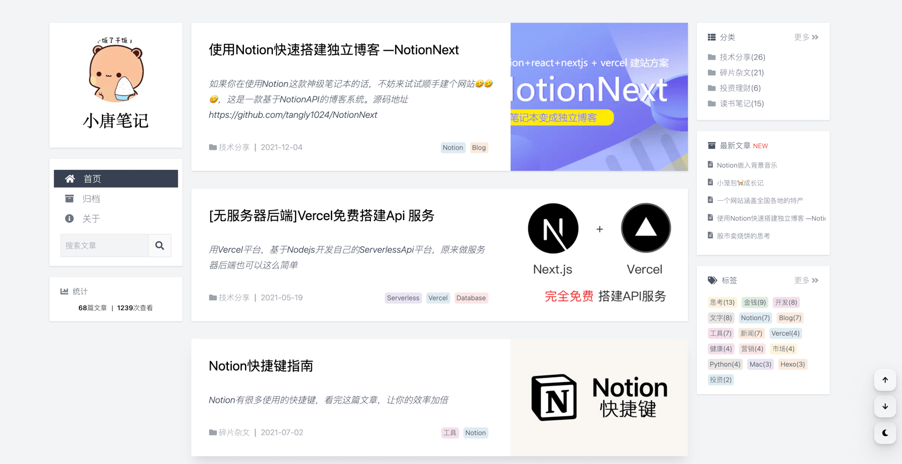
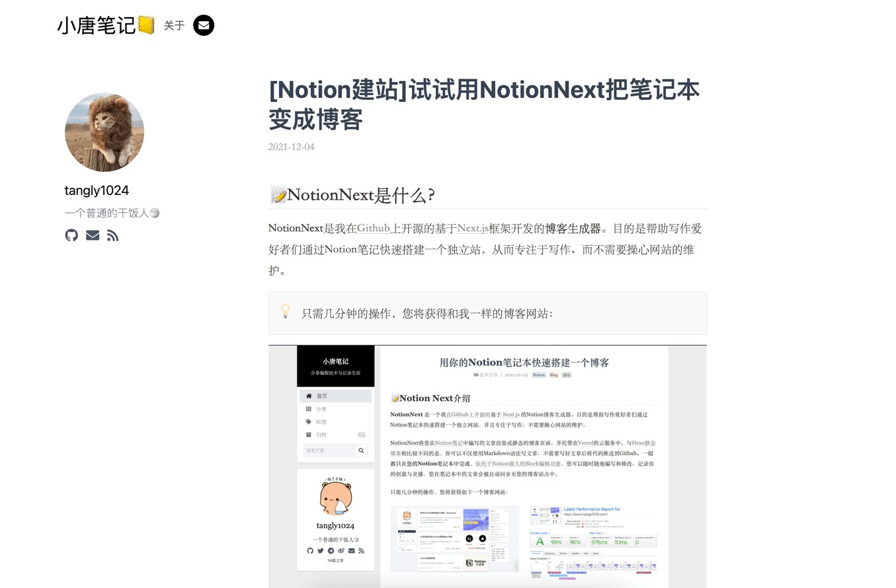
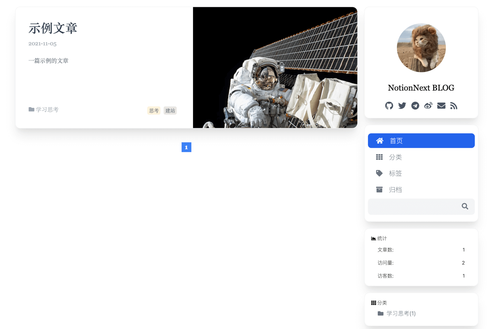
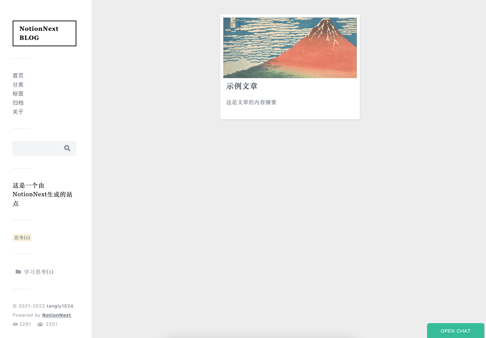

# 帮助教程

访问帮助：[NotionNext帮助手册](https://docs.tangly1024.com/)

> 本项目教程为免费、公开资源，仅限个人学习使用，禁止利用本教程建立的博客发布非法内容、进行违法犯罪活动。严禁任何个人或组织将本教程用于商业用途，包括但不限于直接售卖、间接收费、或其他变相盈利行为。转载、复制或介绍本教程内容时，须保留作者信息并明确注明来源。 
> 本项目仅提供由作者团队授权的付费咨询服务，请注意辨别，谨防诈骗行为。任何未经授权的收费服务均可能存在法律风险。

Notion是一个能让效率暴涨的生产力引擎，可以帮你书写文档、管理笔记，搭建知识库，甚至可以为你规划项目、时间管理、组织团队、提高生产力、还有当前最强大的AI技术加持。

> 如果希望进一步探索Notion的功能，欢迎购买《[Notion笔记从入门到精通进阶课程](https://docs.tangly1024.com/article/notion-tutorial)》

# NotionNext

  
  
  
  

中文文档 | [README in English](./README_EN.md)

一个使用 NextJS + Notion API 实现的，部署在 Vercel 上的静态博客系统。为Notion和所有创作者设计。

支持多种部署方案

## 预览效果

在线演示：[https://preview.tangly1024.com/](https://preview.tangly1024.com/) ，点击左下角挂件可以切换主题，没找到喜欢的主题？[贡献](/CONTRIBUTING.md)一个吧~

| Next                                                                                                  | Medium                                                                                                      | Hexo                                                                                                  | Fukasawa                                                                                                          |
| ----------------------------------------------------------------------------------------------------- | ----------------------------------------------------------------------------------------------------------- | ----------------------------------------------------------------------------------------------------- | ----------------------------------------------------------------------------------------------------------------- |
|  [预览NEXT](https://preview.tangly1024.com/?theme=next) |  [预览MEDIUM](https://preview.tangly1024.com/?theme=medium) |  [预览HEXO](https://preview.tangly1024.com/?theme=hexo) |  [预览FUKASAWA](https://preview.tangly1024.com/?theme=fukasawa) |

## 致谢

感谢Craig Hart发起的Nobelium项目

<table><tr align="left">
  <td align="center"> <a href="https://github.com/craigary" title="Craig Hart">Craig Hart</a></td>
</tr></table>

## 贡献者

感谢所有为 NotionNext 做出贡献的人！

## 引用技术

- **框架**: [Next.js](https://nextjs.org)
- **样式**: [Tailwind CSS](https://www.tailwindcss.cn/)
- **渲染**: [React-notion-x](https://github.com/NotionX/react-notion-x)
- **评论**: [Twikoo](https://github.com/imaegoo/twikoo), [Giscus](https://giscus.app/zh-CN), [Gitalk](https://gitalk.github.io), [Cusdis](https://cusdis.com), [Utterances](https://utteranc.es)
- **图标**: [Fontawesome](https://fontawesome.com/v6/icons/)

## 🔗 友情链接

- [Elog](https://github.com/LetTTGACO/elog) Markdown 批量导出工具、开放式跨平台博客解决方案，随意组合写作平台(语雀/Notion/FlowUs/飞书)和博客平台(Hexo/Vitepress/Halo/Confluence/WordPress等)

## License

The MIT License.

## Star History

