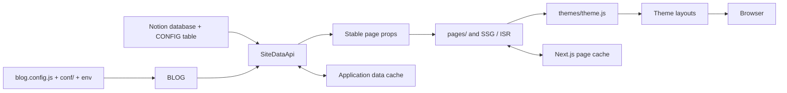

# Architecture Overview

[中文（权威完整版）](./ARCHITECTURE.md)

> The Chinese document is the canonical and complete runtime architecture. This page is a concise English map. When implementation changes, update the Chinese document first and keep this summary consistent with it.

## Runtime spine

NotionNext is a Next.js Pages Router static-site system. Notion is the content source; code and environment variables provide startup configuration; the data layer converts both into stable page props; routes own SSG/ISR and page-level selection; themes own presentation.



The dependency direction is configuration/data source → data model → route → theme. Global filtering, sorting, and Notion access belong in the data or route layers, never inside individual themes.

## Configuration model

Environment variables are applied while `blog.config.js` and `conf/*.config.js` construct `BLOG`:

```text
environment variable > code default
```

That is only the startup phase. General `siteConfig()` resolution in `lib/config.js` is:

```text
runtimeConfigOverrides
> NOTION_CONFIG
> THEME_CONFIG
> extendConfig
> BLOG
> defaultVal
```

Server-special keys such as `THEME`, `LINK`, sorting, paging, ISR, and RSS resolve immediately as:

```text
extendConfig > BLOG > defaultVal
```

A server caller must therefore pass the current Notion configuration as `extendConfig` for those keys to use it. `THEME_SWITCH` has an environment hard override. Low-level Notion connection keys (`NOTION_INDEX`, `NOTION_PROPERTY_NAME`, `NOTION_ACTIVE_USER`, and `NOTION_TOKEN_V2`) cannot be overridden by the Notion CONFIG table.

The CONFIG table accepts the bilingual columns `启用/Enable`, `配置名/Name`, and `配置值/Value`. Only an exact `Yes` enables a row. JSON values are parsed, `INLINE_CONFIG` is spread at the top level, and invalid rows are ignored.

## Site metadata

`getSiteInfo()` resolves metadata as follows:

| Output | Resolution order |
| --- | --- |
| `title` | main database title → `NOTION_CONFIG.TITLE` / default |
| `description` | main database description → `NOTION_CONFIG.DESCRIPTION` / default |
| `pageCover` | database cover → collection-view-page cover → config / default |
| `icon` | database icon → `AVATAR` / default |
| `link` | `NOTION_CONFIG.LINK` → `BLOG.LINK` |

Consequently, the main Notion database description is the primary website description; CONFIG `DESCRIPTION` is only its fallback. The canonical website URL should be stored in CONFIG `LINK`.

## Notion data pipeline

`lib/db/notion/getNotionAPI.js` reads Notion through `notion-client` and the internal v3 API. Public pages can be read anonymously; private reads can use `NOTION_ACTIVE_USER` and `NOTION_TOKEN_V2`. Build/export mode adds rate limiting, in-flight Promise deduplication, and a cross-process file lock.

This read boundary is separate from official API writes. Writes use a server-only `NOTION_API_TOKEN` or OAuth/MCP authorization, including the content MCP under `tools/notionnext-content-mcp/`. Tokens must never use the `NEXT_PUBLIC_` prefix.

`fetchGlobalAllData({ pageId, from, locale })` selects the proper multilingual page ID, reads through `global_data_<locale>_<pageId>`, calls `getSiteDataByPageId()`, removes server-only fields, and returns a deep clone.

`convertNotionToSiteData()` validates and normalizes the database, parses CONFIG, maps records, keeps slugged Published/Invisible pages, applies sorting and optional pinning, and derives navigation, menus, notices, categories, tags, recent posts, links, members, and events. `handleDataBeforeReturn()` removes raw Notion structures and applies scheduled-publishing visibility before data reaches the browser.

The stable props contract includes `NOTION_CONFIG`, `siteInfo`, `allPages`, `notice`, category/tag options, custom navigation/menu data, recent posts, link/member/event collections, and `postCount`. Routes normally narrow or remove `allPages` before returning final props.

## Routes, themes, and browser state

Files under `pages/` own URL interpretation, `getStaticProps/getStaticPaths`, filtering, pagination, and ISR. `conf/layout-map.config.js` maps route semantics to layout exports such as `LayoutIndex`, `LayoutPostList`, `LayoutArchive`, `LayoutSearch`, and `LayoutSlug`.

`pages/_app.js` selects the base theme in this order:

```text
URL ?theme > pageProps.NOTION_CONFIG.THEME > BLOG.THEME
```

`themes/theme.js` validates against build-time `THEMES`, dynamically imports `themes/<theme>`, and caches layouts. Missing themes fall back to the configured base theme, `example`, another installed theme, and finally an empty layout. A missing named layout falls back to `LayoutSlug`.

`lib/global.js` manages language, locale, theme, dark mode, loading state, theme configuration, and runtime overrides. Visual-theme switching and dark-mode switching are separate mechanisms.

## Cache and regeneration

`lib/cache/cache_manager.js` uses a read-through backend chain:

1. Redis when `REDIS_URL` is configured;
2. file cache during builds or outside production;
3. process memory.

It deduplicates in-flight work, uses a file lock plus a second cache check during builds, and degrades to the next backend on cache failure. Notion remains the source of truth; cached values are projections.

Application data cache and Next.js SSG/ISR page cache are independent. ISR defaults to 60 seconds. `POST /api/revalidate` accepts Bearer `REVALIDATION_TOKEN` and can refresh one or more paths or clear local file cache for an `all` refresh. Static export has no ISR.

## Failure behavior and invariants

- Notion, cache, theme, or layout failures degrade to empty/last data or fallback rendering where possible.
- Invalid main databases produce empty data; invalid CONFIG rows are skipped.
- Missing revalidation credentials disable the endpoint; invalid credentials return 401.
- Notion is the content source of truth; caches are disposable.
- Secrets stay server-side, and theme packages do not own content rules.
- Routes may derive page-specific props but must not mutate shared cached data.
- External services such as Clerk, comments, analytics, search, AI, and ads attach to the main spine; they do not replace it.

For the complete route map, operational deployment snapshot, safe-change rules, and verification checklist, see the [canonical Chinese architecture](./ARCHITECTURE.md).
