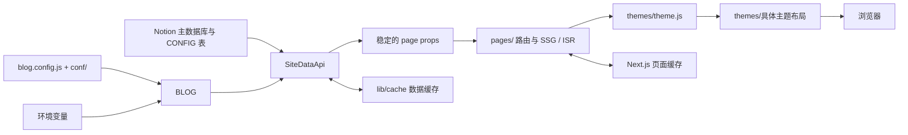

# 架构总览

[English](./ARCHITECTURE.en.md)

本文是 NotionNext 运行架构的主说明，描述配置如何进入系统、Notion 数据如何转成页面数据、路由与主题怎样协作，以及缓存和增量静态再生成（ISR）的边界。实现发生变化时，应同步更新本文，避免让部署说明、主题说明成为互相冲突的架构来源。

## 1. 系统主链路

NotionNext 是基于 Next.js Pages Router 的静态站点生成系统。Notion 是内容源，代码与环境变量提供启动配置，数据层把两者归一化成稳定的页面属性，主题只负责展示。



依赖方向固定为“配置与数据源 → 数据模型 → 路由 → 主题”。主题不得反向承担 Notion 查询、全站过滤或配置解析，否则相同内容会在不同主题中产生不同业务行为。

| 层 | 主要位置 | 职责 |
| --- | --- | --- |
| 启动配置 | `blog.config.js`、`conf/` | 合并代码默认值和环境变量，形成 `BLOG` |
| Notion 读取 | `lib/db/notion/` | 调用 Notion、解析数据库和 CONFIG 表、控制请求并发 |
| 数据组装 | `lib/db/SiteDataApi.js` | 归一化原始数据，生成全站模型和页面属性 |
| 缓存 | `lib/cache/` | 为站点数据与页面块提供读穿缓存和并发去重 |
| 路由 | `pages/` | 解析 URL，过滤、分页，执行 SSG/ISR，选择布局语义 |
| 主题 | `themes/theme.js`、`themes/*/` | 动态加载主题，以统一属性契约渲染 UI |
| 浏览器状态 | `lib/global.js`、`pages/_app.js` | 管理语言、主题、深色模式、加载态和客户端覆盖值 |

## 2. 启动、构建与配置装配

项目使用 Yarn 1，要求 Node.js `>=22 <25`。常用生命周期为：

- `yarn dev`：本地开发；
- `yarn build`：设置 `BUILD_MODE=true` 后执行 Next.js 构建；
- `yarn export`：同时设置 `BUILD_MODE=true` 和 `EXPORT=true`，生成纯静态产物；
- `yarn start`：运行已构建的 Next.js 应用。

`blog.config.js` 聚合 `conf/*.config.js`，并在模块加载时读取环境变量。例如 `NOTION_PAGE_ID`、`NEXT_PUBLIC_THEME` 和 `NEXT_PUBLIC_REVALIDATE_SECOND` 会直接参与 `BLOG` 的构造。因此第一阶段的优先级是：

```text
环境变量 > blog.config.js / conf/ 中的代码默认值
```

`next.config.js` 在构建时扫描 `themes/` 的一级目录，将可用主题写入 `publicRuntimeConfig.THEMES`；同时会从带语言前缀的 `NOTION_PAGE_ID` 推导站点 locale。新增主题目录或多语言站点 ID 都会影响构建产物，而不只是运行时状态。

## 3. 配置模型

### 3.1 配置来源与优先级

系统有五类配置来源，不能用一条“Notion > 环境变量 > 本地文件”概括：

1. `BLOG`：代码默认值和环境变量合并后的启动配置；
2. `NOTION_CONFIG`：Notion CONFIG 数据库中的业务配置；
3. `THEME_CONFIG`：当前主题的 `config.js`；
4. `extendConfig`：服务端调用者显式传入的配置，通常就是本次读取到的 Notion 配置；
5. `runtimeConfigOverrides`：浏览器运行期间的临时覆盖值。

普通配置通过 `lib/config.js` 中的 `siteConfig()` 读取，优先级为：

```text
runtimeConfigOverrides
> NOTION_CONFIG
> THEME_CONFIG
> extendConfig
> BLOG
> defaultVal
```

但 `THEME`、`LINK`、排序、分页、ISR、RSS 等服务端特殊配置，为避免构建期与客户端取值不一致，会立即按下面的顺序返回：

```text
extendConfig > BLOG > defaultVal
```

因此服务端若希望采用 Notion CONFIG 的值，调用 `siteConfig()` 时必须把本次的 `NOTION_CONFIG` 作为 `extendConfig` 传入。只在全局变量中存在 Notion 配置并不足以覆盖这些服务端键。

另外还有几个特例：

- `THEME_SWITCH` 受环境变量硬覆盖；
- `TITLE`、`DESCRIPTION`、`HOME_BANNER_IMAGE`、`AVATAR` 可从 `siteInfo` 回退；
- Waline 的兼容配置有额外键名映射；
- `NOTION_INDEX`、`NOTION_PROPERTY_NAME`、`NOTION_ACTIVE_USER`、`NOTION_TOKEN_V2` 属于底层连接配置，不能由 Notion CONFIG 表反向覆盖。

### 3.2 Notion CONFIG 表

`lib/db/notion/getNotionConfig.js` 负责解析 CONFIG 页面及其表格变体。每一行使用以下字段：

| 中文列 | 英文列 | 含义 |
| --- | --- | --- |
| `启用` | `Enable` | 只有精确值 `Yes` 才生效 |
| `配置名` | `Name` | 配置键 |
| `配置值` | `Value` | 配置值，合法 JSON 字符串会被解析 |

CONFIG 没有固定键白名单；能否生效取决于代码是否消费对应键。`INLINE_CONFIG` 会在解析后展开到顶层并覆盖同名键；`CONTACT_EMAIL` 会经过特殊加密处理。无效行会被忽略，不会中断整站构建。

### 3.3 站点元信息

`getSiteInfo()` 将 Notion 主数据库元信息与配置合并：

| 输出字段 | 取值顺序 |
| --- | --- |
| `title` | 主数据库标题 → `NOTION_CONFIG.TITLE` / 默认值 |
| `description` | 主数据库描述 → `NOTION_CONFIG.DESCRIPTION` / 默认值 |
| `pageCover` | 数据库封面 → collection view page 封面 → 配置 / 默认值 |
| `icon` | 数据库图标 → `AVATAR` / 默认值 |
| `link` | `NOTION_CONFIG.LINK` → `BLOG.LINK` |

这意味着修改网站“描述”时，优先修改 Notion 主数据库的 Description；只有数据库描述为空时，CONFIG 表中的 `DESCRIPTION` 才会成为回退值。网站规范地址则应修改 CONFIG 表中的 `LINK`。

## 4. Notion 数据获取与归一化

### 4.1 读取与写入边界

`lib/db/notion/getNotionAPI.js` 使用 `notion-client` 访问 Notion 内部 v3 API，默认端点为 `https://app.notion.com/api/v3`。公开页面可匿名读取；私有页面需要 `NOTION_ACTIVE_USER` 和 `NOTION_TOKEN_V2`。构建或导出模式下会启用请求限流、进程内 Promise 去重以及跨进程文件锁，避免并行生成页面时重复拉取相同数据。

这条读取链路与官方 Notion API 的写入权限相互独立：

- 站点读取凭据：内部 API 的 `NOTION_TOKEN_V2` / `NOTION_ACTIVE_USER`；
- 内容写入凭据：官方 API 的 `NOTION_API_TOKEN`，或通过 OAuth/MCP 获得的授权；
- 官方 API 写入能力由 `tools/notionnext-content-mcp/` 和翻译工具等使用；
- 所有 Token 都必须只存在于服务端，禁止使用 `NEXT_PUBLIC_` 前缀。

### 4.2 全站数据入口

`fetchGlobalAllData({ pageId, from, locale })` 是路由获取全站数据的主入口。其流程是：

1. 以 `global_data_<locale>_<pageId>` 为缓存键查询全站数据；
2. 解析逗号分隔的多语言页面 ID，选择默认站点或与 locale 匹配的站点；
3. 调用 `getSiteDataByPageId()` 获取并转换 Notion 数据；
4. 通过 `handleDataBeforeReturn()` 移除服务端内部字段；
5. 返回深拷贝，防止路由层过滤数据时污染共享缓存对象。

### 4.3 数据转换

`convertNotionToSiteData()` 是原始 Notion 模型到站点模型的核心转换器。它会：

1. 归一化 block、collection、schema 和 query；
2. 验证主页面是否为数据库，收集页面与视图 ID；
3. 将数据库记录映射成统一页面对象；
4. 读取 CONFIG 页面及配置表；
5. 仅保留具有 slug 且状态为 Published 或 Invisible 的页面；
6. 按 `POSTS_SORT_BY=date` 等规则排序，并可使用 `TOP_TAG` 置顶；
7. 派生公告、分类、标签、导航、菜单、最新文章、友情链接、成员和事件等聚合数据；
8. 生成服务端完整模型，再裁剪成可发送到浏览器的模型。

`handleDataBeforeReturn()` 会删除 `block`、`schema`、`rawMetadata`、`pageIds`、`viewIds`、`collection`、`collectionQuery`、`collectionId` 和 `collectionView` 等内部字段，清理 ID、页面和标签，并应用定时发布可见性规则。

## 5. 页面属性契约

数据层向路由和主题提供的稳定属性主要包括：

| 属性 | 作用 |
| --- | --- |
| `NOTION_CONFIG` | 本次站点读取到的 Notion 配置 |
| `siteInfo` | 标题、描述、图标、封面和站点链接 |
| `allPages` | 全部归一化页面；路由返回前通常会继续过滤或移除 |
| `notice` | 公告内容 |
| `categoryOptions` / `tagOptions` | 分类和标签聚合 |
| `customNav` / `customMenu` | 自定义导航与菜单 |
| `latestPosts` | 最新文章列表 |
| `allNavPages` / `allLinkPages` | 导航页和友情链接页 |
| `allMembers` / `allEvents` | 成员和事件数据 |
| `postCount` | 文章总数 |

路由和主题应依赖这个契约，不应直接依赖 Notion 原始 block 或 collection 结构。更改字段语义时，需要同时审查所有路由和主题消费者。

## 6. 路由、SSG 与 ISR

`pages/` 下的路由负责 URL 参数、业务过滤、选页、分页和 `getStaticProps/getStaticPaths`；主题负责呈现，不负责业务筛选。`conf/layout-map.config.js` 把路由语义映射到主题布局：

| 页面类型 | 布局 |
| --- | --- |
| 首页 | `LayoutIndex` |
| 列表、分类、标签、分页 | `LayoutPostList` |
| 归档 | `LayoutArchive` |
| 搜索 | `LayoutSearch` |
| 通用内容 | `LayoutSlug` |
| 404、认证、后台 | 对应的特殊布局 |

`pages/index.js` 展示了完整的首页生命周期：读取全站数据，筛选 Published Post，执行分页，在构建阶段生成 robots、RSS、sitemap，清理 Algolia 数据并生成重定向，最后返回由 `NEXT_REVALIDATE_SECOND` 控制的 `revalidate`。

ISR 默认间隔是 60 秒。`POST /api/revalidate` 使用 Bearer `REVALIDATION_TOKEN` 验证请求，可刷新指定 path、多个 paths 或 all。all 会清理本地文件缓存并重新验证首页；其余页面在后续访问时更新。`EXPORT=true` 的纯静态导出没有 ISR。`pages/api/cache.js` 还提供使用 `CACHE_REVALIDATION_TOKEN` 的低层缓存清理入口，它不是页面再生成的替代品。

## 7. 主题系统

`pages/_app.js` 选择基础主题，优先级为：

```text
URL ?theme
> pageProps.NOTION_CONFIG.THEME
> BLOG.THEME
```

`themes/theme.js` 会先用构建期生成的 `THEMES` 校验主题名，再动态加载 `@/themes/<theme>`，并缓存基础布局及“主题 + 页面”布局。加载失败时依次回退到：

1. `BLOG.THEME` 指定的主题；
2. `example`；
3. 其他已安装主题；
4. 空布局。

主题缺少某个布局导出时回退到 `LayoutSlug`。每个主题目录至少应提供 `index.js`、`config.js` 及 `LayoutBase`、`LayoutIndex` 等约定布局导出。

`lib/global.js` 管理语言、locale、当前主题、深色模式、加载态、主题配置和运行时覆盖值。主题切换会把选择写进 URL query；深色模式是独立状态，不等于更换视觉主题。

## 8. 两层缓存模型

系统有两组互相独立的缓存：

1. `lib/cache/` 的应用数据缓存，缓存 Notion 的归一化投影；
2. Next.js SSG/ISR 页面缓存，缓存最终 HTML 和页面数据。

`lib/cache/cache_manager.js` 的缓存链按以下顺序工作：

```text
Redis（存在 REDIS_URL）
> 构建阶段或非生产环境的文件缓存
> 内存缓存
```

它采用读穿策略、进程内 Promise 去重，以及构建期跨进程文件锁和二次检查。任一缓存后端失败都会向下回退，不应使站点整体不可用。典型键包括：

- `global_data_<locale>_<pageId>`：全站数据；
- `site_<pageId>`：单站数据；
- “页面 ID + last edited version”：页面 block。

缓存只是 Notion 数据的投影，Notion 才是事实来源。清理数据缓存不会自动刷新已经生成的页面；反过来，只触发 ISR 也可能继续读到尚未过期的数据缓存。排查陈旧内容时必须分别检查这两层。

## 9. 失败与降级路径

| 故障 | 行为 |
| --- | --- |
| Notion 请求失败 | 记录日志，使用可用缓存；无数据时返回空模型 |
| 主页面不是数据库 | 返回 `EmptyData` |
| CONFIG 行格式错误或未启用 | 忽略该行 |
| 主题不存在或加载失败 | 按主题回退链降级 |
| 布局导出缺失 | 使用 `LayoutSlug` |
| Redis / 文件缓存失败 | 回退到下一缓存层或直接访问数据源 |
| 未配置再验证 Token | 关闭对应 API 能力 |
| 再验证 Token 错误 | 返回 401 |
| bundle analyzer 场景 | 返回 `EmptyData`，避免真实数据请求 |

这些降级保证了可用性，但可能掩盖配置错误。生产环境应同时观察构建日志、Notion 请求日志和再验证响应。

## 10. 外部集成边界

Clerk、Notion OAuth 回调、Notion 评论 API、统计、广告、搜索、AI 和外部插件都附着在主链路上，并不形成另一套页面渲染路径。关键入口包括 `pages/_app.js`、`pages/api/auth/callback/notion.ts`、`pages/api/notion-comments.js` 和各自的配置模块。集成失败时应局部降级，不能改变“Notion → SiteDataApi → 路由 → 主题”的主依赖方向。

## 11. 安全变更规则

- 全局排序、发布可见性、分类和导航派生规则应下沉到数据层，避免每个路由和主题重复实现。
- URL 参数、分页与页面级选择属于路由；样式、组件结构与交互呈现属于主题。
- 服务端特殊配置新增 Notion 覆盖能力时，必须显式传递 `extendConfig` 并验证构建期行为。
- 不得把 Notion 原始内部结构直接暴露给浏览器。
- 修改缓存键、模型字段或布局名称属于契约变更，需要审查全部生产者和消费者。
- 修改内容后若页面未更新，应依次检查 Notion 写入结果、应用数据缓存、ISR 页面缓存和 CDN。
- Notion、Redis、Clerk、再验证等密钥只能放在服务端环境变量中。

## 12. 当前部署观察（非架构契约）

以下内容是 **2026-09-07** 对 Vercel 项目 `createsuns-projects/notion-next` 与对应 Notion 数据的观察，会随部署和内容修改而变化，不能作为代码默认值：

| 项目 | 当时观察值 |
| --- | --- |
| 生产域名 | `https://www.createsun.work` |
| `NEXT_PUBLIC_THEME` | `typography` |
| `NOTION_PAGE_ID` | `1511342176238043ae41f069bdf283f3` |
| Notion CONFIG 的 `THEME` | 未设置，因此最终使用 `typography` |
| Notion 主数据库标题 | `闲裁彩山` |
| Notion 主数据库描述 | `一个互联网前端开发工程师的个人博客` |
| Notion CONFIG 的 `LINK` | `http://createsun.work` |

目标描述“在代码与生活的缝隙里，记录所思、所见与微小欢喜。”和目标 LINK `https://www.createsun.work` 尚未在本次架构文档变更中写回 Notion。写回需要使用已授权的官方 Notion API/MCP，并在写入后重新读取数据、触发 ISR，再从生产页面验证最终值。

## 13. 验证入口

架构变更后，至少执行与改动相关的验证：

- `yarn docs:site:build`：验证 Markdown、Mermaid 和文档导航；
- `yarn lint`：检查代码质量；
- `yarn test`：验证数据转换、配置和缓存逻辑；
- `yarn build`：验证 Next.js SSG、主题扫描和生产构建；
- 对配置或内容更新：重新读取 Notion 数据并检查生产页面的 title、description、canonical、主题与更新时效。
